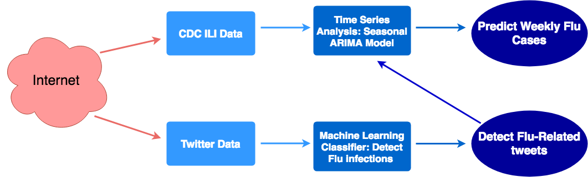
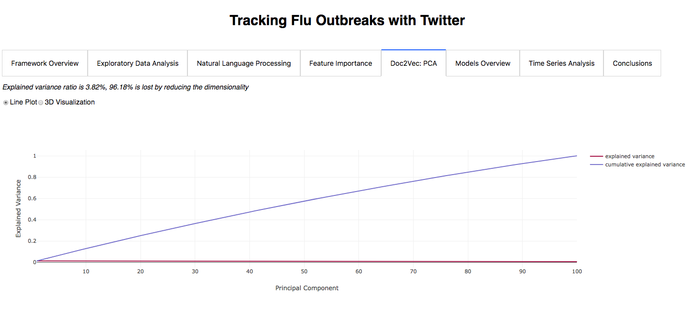
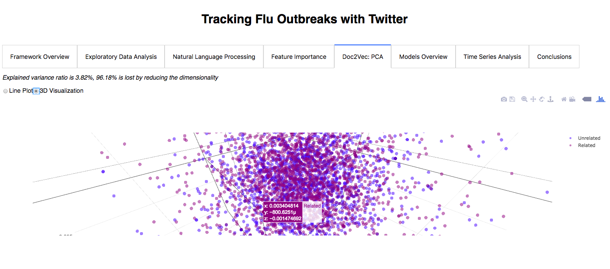
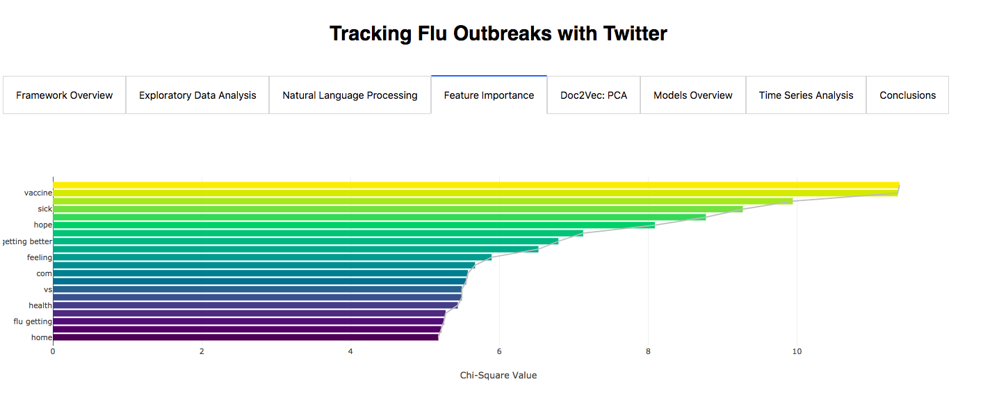
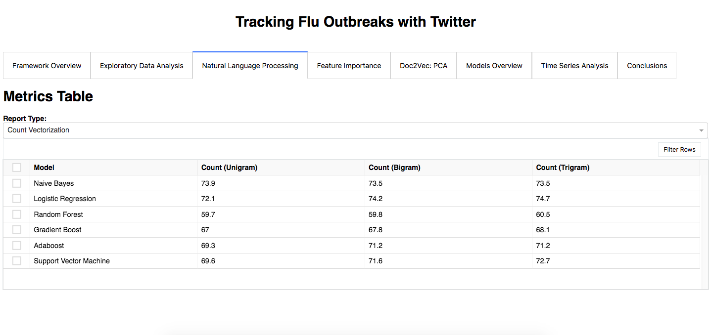
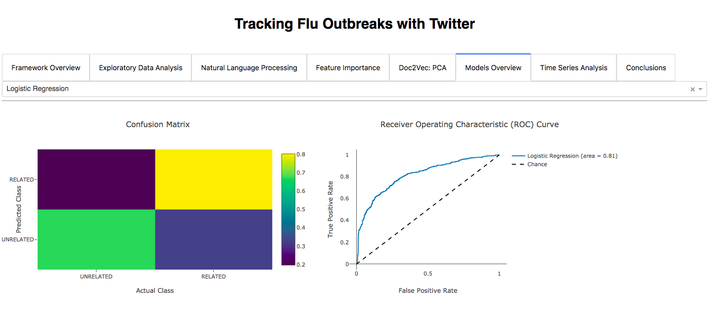
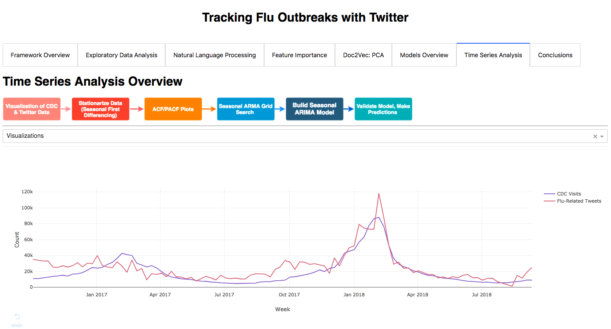
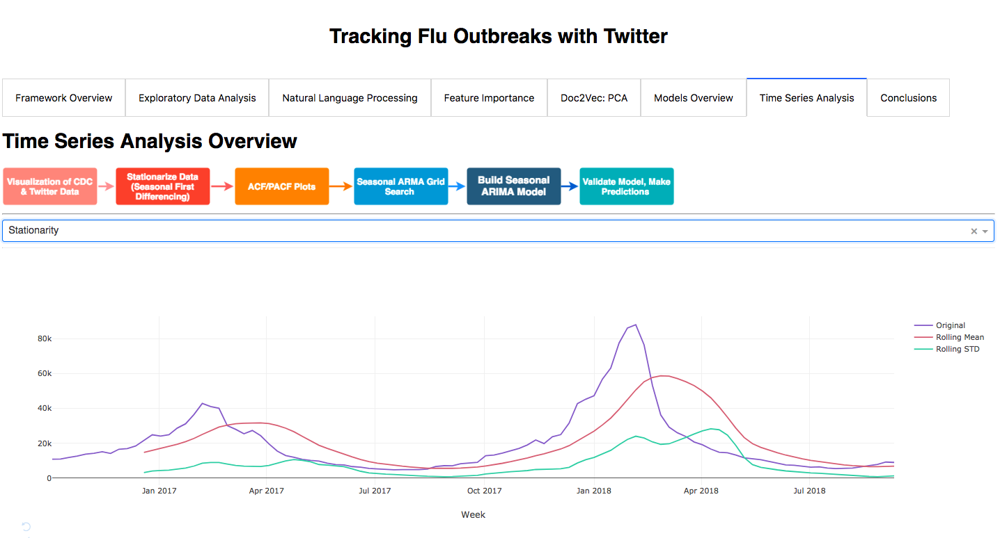
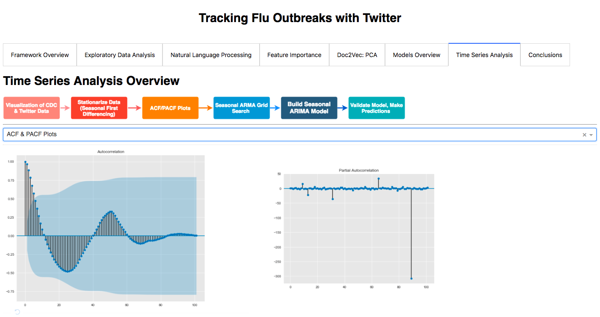

# Tracking Flu Outbreaks with Twitter

## Project Motivation
Currently, official data sources to identify and predict future disease counts are limited. CDC data for influenza-related visits, for example, is released on a 2-week delay which gives less information than might be ideal. If we are able to identify and incorporate real-time data such as tweets, we might be able to better predict immediate and future outbreaks. This would allow us to respond more quickly to outbreaks which would improve outcomes and thus, population health.   

## Process Overview

## Data Sources 
### Database
A PostgreSQL database was built, using SQLAlchemy to construct the schema. 

### Twitter
Historical tweet IDs were 'hydrated' by feeding in those IDs into the Twitter API and retrieving associated information. These tweets were then filtered (using keywords such as 'flu' and 'influenza') and only relevant tweets were stored in a PostGres database. Tweets from October 2016 to August 2018 were hydrated. More than 5 million historical tweets containing any of the specified keywords were identified. 

Relevant live tweets were also stored in the PostGres database as they occurred. 

Tweet texts were cleaned as well:

* URL links were removed 
* Contractions were changed (haven't --> have)
* Numbers and special characters were removed
* All words changed to lower-case

**Annotated Tweets**
Annotated tweets were taken from http://cmci.colorado.edu/~mpaul/downloads/flu_data.php 

Tweet IDs were hydrated and some tweets removed. 

### CDC
CDC data on influenza-related visits were taken from the CDC website. For the purposes of this project, CDC data was considered 'ground truth'. 

## Visualizations
All visualizations were presented on a Flask app, using Dash as an interactive interface. 

## Natural Language Processing: Feature Extraction
In order to be used in machine learning algorithms, text must be converted into vectors of numbers. Such vectors are intended to represent characteristics of the texts. Two models were used: the Bag-of-Words model and vector embedding. 

### Bag-of-Words (BoW)
A BoW is a simplistic representation of a document; the occurrence of each word is measured and used as a feature. It is called a *bag* of words because the arrangement of the words, or any other details, are not considered. Documents are simply characterized by the presence of known words.

n-gram features: The size of word pairings were also assessed: unigram (only single words are counted), bigram (1 to 2 words are counted), trigram (1 to 3 words are counted). That is, you can also work with pairs and triplets of words, rather than just single words. For example, 'new york' is more informative than 'new' and 'york', separately. 

**Count Vectorization**

The (count) frequency of each known word in a given document is measured. 

**TF-IDF Vectorization**

The frequency of each known word is offset by its overall frequency in the corpus (the collection of documents). 

### Word Embedding: Doc2Vec
In contrast with the BoW model, word embedding also considers the *context* of words. Doc2Vec is an unsupervised algorithm that generates vector representations of documents, regardless of length, in order to assess the similarity between documents. Each document is mapped to a unique vector and each word is mapped to a unique vector. 

It should be noted that there are a few caveats to using Doc2Vec for this particular dataset: 

(1) Because the corpus is composed of tweets, with many misspellings, Doc2Vec is not necessarily ideal because it's much more difficult to assess the similarity between tweets as there are so many variations in spelling and phrases. 

(2) The training set was fairly limited in size and not diverse enough for a Doc2Vec model to learn true contextual relations and generate reasonably embeddings accordingly. 

However, I wanted to compare word embedding to the BoW model in order to see how it handled my data. 

**Principal Component Analysis**

In conjunction with Doc2Vec, I also conducted principal component analysis for potential dimensionality reduction. If there are certain features that are more 'important' for characterizing flu/non-flu related tweets and others that are considerably less important, then it makes more sense to only use the more important features. The less important features don't contribute much and only add to the time and computational resources needed for subsequent classification. 

The fairly linear trend of the cumulative explained variance (in purple) indicates that each of the principal components roughly equally contributes to the explained variance -- dimensionality reduction would not be helpful. The explained variance (in maroon) remains flat as well. 

This is also evident with a 3D plot, where the data was arbitrarily reduced to 3 dimensions. 

There are no distinct clusters between related and unrelated tweets in 3 dimensions so reduction to, say, 3 dimensions would not be helpful. Indeed, 96.18% of explained variance is lost by reducing to 3 dimensions. 

### NLP Model Selection
After experimentation with the BoW model and word embedding, I chose to use trigram TF-IDF vectorization because it worked the best with my data. 

### Feature Importance
I used the chi-square statistic to measure the relationship between a given feature (word in a tweet) and the tweet class (related or unrelated to flu infection). 

I plotted the top 10 features, with the highest chi-square values, to determine which features were the *most* predictive of a tweet's class. 

## Machine Learning: Tweet Identification
The following machine learning classification algorithms were used:
* Multinomial Naive Bayes 
* Logistic Regression
* Random Forest
* Gradboost
* Adaboost
* Support Vector Machine

For cross-validation,the annotated tweet dataset was split into training and validation sets.

For each classifier, a grid-search was run to determine the best hyperparameters for the given classifier. Classifiers were then fit on the training data and assessed using the following metrics:

* Validation accuracy
* Confusion matrices
* ROC curves

### Cross-Validation: Validation Accuracy
A given classification model was fit on the training data. It then classified the validation data. To assess the accuracy of the model, those predictions were compared to the actual labels. 

### Confusion Matrices
For a given classifier, a confusion matrix could be constructed. The confusion matrix is used to show the number of:

* True positives: Related tweets that the classifier labeled as related
* True negatives: Unrelated tweets that the classifier labeled as unrelated
* False positives: Unrelated tweets that the classifier labeled as related
* False negatives: Related tweets that the classifier labeled as unrelated

### ROC Curves
The Receiver Operator Characteristic (ROC) curve is used to assess the classification ability of a classification model, by plotting the true positive rate against the false positive rate. The faster the curve 'peaks', the better the true positive rate without necessarily having very many false positives. The area under the curve (AUC) is a measure derived from the ROC curve. The baseline is 'chance'; a 50% accuracy indicates a useless classifier (because it's no better than randomly guessing). The higher the AUC, the 'better' the classification model. 

### Machine Learning Model Selection 
Logistic regression with L2 regularization was selected as the best classifier for this dataset, with about 74.7% validation accuracy and AUC of 0.81. 

## Time-Series Analyses

### Visualizations

When plotting CDC visits and flu-related tweets, it is clear that there is a seasonal nature to the data. CDC and Twitter data are roughly in sync, although there are some differences between CDC and Twitter data. This is assumed to be due to noise in the Twitter data as the classification model was not perfect in identifying relevant tweets and there are likely to be 'false positives' in the Twitter data. However, the data seems to be as expected. 

Peaks in the data correspond with the known flu season (~November to April). It should be noted that the peak is much larger for the 2017-2018 season than for the 2016-2017 season because the season was particularly bad for that year. 

### Stationarization of Data

Before any time-series modeling can be conducted, the data must first be assessed for stationarity. Time-series modeling is regression modeling which is contingent on 4 core assumptions:

1. Independence of observations: observations are not related to each other
2. Linear relationship of data
3. No/little multicollinearity
4. Homoscedasticity: variance around the regression line is the same for all observations
5. Normality of data

Because this is time-series data, it is clear that the first assumption is violated. Observations are time-dependent; an observation at a past timepoint will influence a future observation. This is evident when plotting the rolling mean and standard deviations of the data:

The mean and variation change over time and do not stay the same as would be expected for independent observations. This is confirmed by the Dickey-Fuller hypothesis test (H0: the data is not stationary). The p-value was found to be greater than 0.05. At 5% significance, we fail to reject the null hypothesis that the data is not stationary. 

There are different ways to stationarize the data; I tried different methods including: taking the log of the data, differencing the log, etc. I found that the most effective way of stationarizing the data was to take the seasonal first difference of the data (take the difference between timepoints a 'season' apart); this was confirmed with a Dickey-Fuller test. 

### Autocorrelation and Partial Autocorrelation Functions

The autocorrelation function (ACF) and partial autocorrelation function (PACF) were plotted. 

The ACF tells you how points are correlated with each other, based on how many time steps they are separated by.

The Pearson's correlation coefficient was also used to calculate how strongly points are related to each other. The Pearson's correlation coefficient was ~0.97 for time points separated by 1 time step, suggesting a very strong correlation. 

The PACF tells you how points are correlated with each other, but with the effects of the intervening time steps *removed*. 

PACF is used for AR model diagnostics and ACF is used for MA model diagnostics.

### Seasonal ARIMA Model
The Auto Regressive Integrated Moving Average (ARIMA) model has the following hyperparameters to account for seasonality, trend, and noise in the data:

1. Number of auto regressive terms (p): the effects of past values 
2. Number of differences (d): the amount of differencing (see above)
3. Number of moving average terms (q): the error of the model as a linear combination of the error values observed at previous time points in the past

(P, D, Q) follow the same definition but are applied to the seasonal component of the time series.

The optimal values for these hyperparameters were selected based on prior steps and a gridsearch. The model was then built.

### Model Selection 
A model with just CDC data was constructed and validated using one-step ahead forecasting (comparing model predictions to known values). A separate model, with CDC model and Twitter data as an exogenous variable, was also constructed and validated using one-step ahead forecasting. 

The two models were compared, using the RMSE values from one-step ahead forecasting. The RMSE for the model with both CDC and Twitter data was found to be lower than that for the CDC-only model (~3400 vs. 3600). This indicates that Twitter data does contribute to the model in some way such that the model with both CDC and Twitter data does better at predicting future values than the model with just CDC data. 

## Conclusions 
* Logistic regression was the best-performing classifier, with TF-IDF vectorization (with trigrams) used to process the annotated tweets
* The SARIMA model that included both CDC & Twitter data did better at one-step ahead forecasting than the SARIMA model with just CDC data, using RMSE as a metric (3651.55 vs. 3448.62)
* This implies that flu-related tweets contribute to the SARIMA model in some way that improves the predictive ability of the SARIMA model
* Next steps include forecasting national flu cases for future flu seasons 
